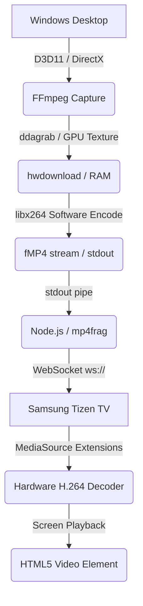

# CKast: Developer-Level Operations & Deployment Guide

This guide provides technical specifications, deployment steps, and troubleshooting procedures for operating the **CKast** screen-mirroring pipeline.

---

## 1. System Architecture & Data Flow

CKast operates as a low-latency, real-time desktop capture and relay system utilizing a pull-push configuration:



### Protocol Stack
- **Ingestion**: Windows DXGI Desktop Duplication API via FFmpeg's `ddagrab` filter.
- **Relay Server**: Node.js utilizing `express` for dashboard delivery and `ws` for streaming segments.
- **Payload Format**: Fragmented MP4 (fMP4) containing:
  - An initialization segment (`ftyp` + `moov` boxes).
  - Continuous media fragments (`moof` + `mdat` boxes) emitted at keyframe intervals.
- **De-packetization & Playback**: TV Client JavaScript parsing binary frames via HTML5 Media Source Extensions (MSE) with `SourceBuffer.mode = 'sequence'`.

---

## 2. Environment & Prerequisites

### Broadcaster PC (Windows)
- **OS**: Windows 8+ (required for Desktop Duplication API).
- **Runtime**: Node.js v16+ (requires `npm install` for dependencies: `express`, `ws`, `mp4frag`).
- **FFmpeg**: Version 6.0+ compiled with `ddagrab` support and added to the Windows System `PATH`.
  - Install via PowerShell: `winget install Gyan.FFmpeg`
- **Network**: Wired Ethernet or high-throughput 5GHz Wi-Fi.

### Receiver TV (Samsung Tizen)
- **OS**: Tizen Smart TV (Tizen 4.0+ / 2018 models or newer recommended for optimal hardware decoding).
- **Development Tooling**: Tizen Studio with the Tizen SDK CLI tools (`sdb` and `tizen`).
- **Developer Mode**: Enabled on the TV apps panel.
- **Certificates**: A valid Tizen/Samsung author & distributor certificate profile configured in Tizen Studio.

---

## 3. Configuration & Build Runbook

Follow these steps to deploy and build the setup.

### Step 1: Prepare the TV Receiver Target
The packaged TV receiver includes a **PC address** field on the standby screen. The first launch uses the bundled default only as a fallback; after that, the address entered on the TV is saved in Tizen `localStorage` under `ckast-server-ip`.

When the developer PC gets a new IPv4 address, edit the **PC address** field on the TV and press **Connect**. A rebuild is not required for IP changes.

### Step 2: Build and Package the Tizen Widget
Recommended VS Code workflow:

1. Open only the TV app folder in VS Code:
    ```text
    C:\Users\augus\OneDrive\Desktop\GO\CKast-main\tv-app
    ```
2. Run **Tizen TV: Build Signed Package**.
3. Run **Tizen TV: Launch Application** and choose **Run On TV**.

CLI workflow, if needed:

1.  **Clean and Pack**:
    Create the widget package from the `tv-app/` directory:
    ```bash
    cd tv-app
    tizen package -t wgt -o . -- .
    ```
2.  **Sign the Widget**:
    If your profile is named `MyProfile`, sign it using:
    ```bash
    tizen package -t wgt -s MyProfile -- CKast.wgt
    ```

### Step 3: Install the Widget on the TV
Ensure your TV is turned on, in developer mode, and connected to the same local network:

1.  **Connect SDB**:
    ```bash
    sdb connect <TV_IP_ADDRESS>:26101
    ```
2.  **Verify Connection**:
    ```bash
    sdb devices
    ```
    *Should display your TV's serial identifier.*
3.  **Deploy**:
    ```bash
    sdb install CKast.wgt
    ```
    *The app will automatically compile, push, and register on the TV's launcher bar.*

---

## 4. Operational Commands & Server Lifecycle

### Booting the Broadcaster
Navigate to the `pc-broadcaster/` folder.

#### Option A: Interactive Command Shell
1.  Initialize dependencies (first-time only):
    ```bash
    npm install
    ```
2.  Launch:
    ```bash
    node server.js
    ```

#### Option B: Automatic Cleanup & Launch (Recommended)
Double-click `start.bat`. The script executes the following diagnostic commands before booting Node:
1.  Queries processes listening on port 8080: `netstat -a -n -o | findstr :8080`
2.  Kills any existing `node.exe` processes running `server.js`:
    ```cmd
    wmic process where "name='node.exe' and commandline like '%%server.js%%'" call terminate
    ```
3.  Force-closes the socket handler if still locked, then instantiates `node server.js`.

### Initiating the Mirror Stream
1.  Launch the **CKast** App on the Tizen TV (displays "Connecting to server...").
2.  Navigate to `http://localhost:8080` on the PC.
3.  Click **Start Cast**.
    - The server spawns the FFmpeg capture subprocess.
    - `mp4frag` caches the init header and sends it immediately to the TV.
    - Continuous fragments pipe directly to the TV's WebSockets client.

---

## 5. Under the Hood: Critical Code Specs

### FFmpeg Pipeline Configuration
The pipeline is tuned for real-time capture and low-overhead software H.264 encoding:

```javascript
const ffmpegArgs = [
    '-probesize', '42M',             // Bypasses initial format detection latency
    '-analyzeduration', '0',
    '-rtbufsize', '1024M',           // Heavy system buffer to absorb CPU spikes
    '-thread_queue_size', '512',
    '-f', 'lavfi',                   // Captures direct GPU textures via ddagrab
    '-i', 'ddagrab=framerate=60',
    '-vf', 'hwdownload,format=bgra', // Copies textures from VRAM to system RAM
    '-c:v', 'libx264',               // High compatibility CPU encoder
    '-preset', 'ultrafast',          // Fastest encoding strategy (minimum CPU cycles)
    '-tune', 'zerolatency',          // Disables B-frame buffering and lookaheads
    '-sc_threshold', '0',            // Prevents variable-size keyframes on scene changes
    '-g', '15',                      // Emits keyframes every 15 frames (250ms fragments)
    '-keyint_min', '15',
    '-pix_fmt', 'yuv420p',           // Mandatory 4:2:0 format for hardware decoders
    '-b:v', '20000k',                // Target Bitrate (20Mbps for high motion retention)
    '-maxrate', '20000k',
    '-bufsize', '20000k',            // Matches VBV buffer to target to enforce CBR
    '-f', 'mp4',
    '-movflags', '+frag_keyframe+empty_moov+default_base_moof', // fMP4 structural flags
    'pipe:1'
];
```

### Self-Healing & Sleep State Recovery (Watchdog)
To prevent the stream from hanging when the PC sleeps, locked UAC windows pop up, or the display shuts off, a custom server-side watchdog monitors the pipeline:
- Every time `mp4frag` outputs a fragment, `resetWatchdog()` clears the timer.
- If no fragments are received within `5000ms`, the watchdog fires, kills the frozen FFmpeg process, and calls `startCapture()` to reboot the stream.
- When the PC screen wakes up, the watchdog automatically self-heals and resumes the stream on the TV without manual intervention.

---

## 6. Performance Diagnostics & Triage

| Symptom | Probable Cause | Actionable Fix |
| :--- | :--- | :--- |
| **TV display freezes / infinite buffering indicator** | Network packet loss or TV buffer congestion. | Reset the connection by clicking **Stop** then **Start Cast** on the PC dashboard. |
| **Stuttering / dropped frames (CPU bottlenecks)** | Hardware scaling or complex presets. | Ensure `-preset ultrafast` is active. If your CPU still stutters, downscale the capture resolution: change `-vf 'hwdownload,format=bgra'` to `-vf 'scale=-1:720,hwdownload,format=bgra'`. |
| **Blurry particles / macroblocking** | Insufficient VBV bitrate. | Increase the bitrate `-b:v` to `25000k` or `30000k` in `server.js` (requires high-throughput 5GHz Wi-Fi / Ethernet). |
| **"QuotaExceededError" in TV logs** | The TV's native video buffer is full. | Verify that the buffer eviction timer is running in `tv-app/js/main.js` (`evictBuffer()`). |
| **WebSocket handshake failures** | Network routing or firewall blocks. | Ensure Port 8080 is open on your Windows Firewall for both incoming TCP/UDP connections. |
